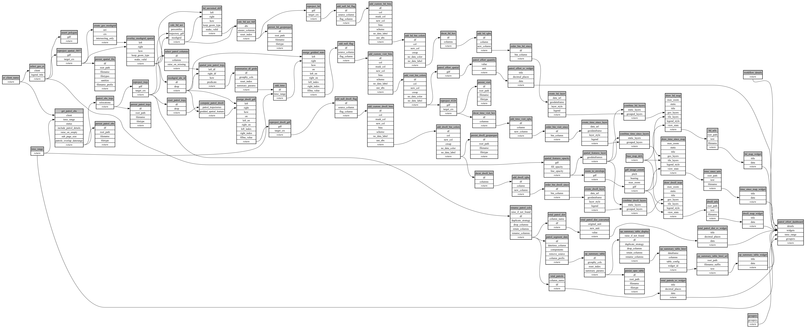

```
# AUTOGENERATED BY ECOSCOPE-WORKFLOWS; see fingerprint in README.md for details

```

```yaml
# fingerprint:
artifacts_sha256_basic: ac201e12016b6f4d3efbaa7e19526cd8ed7917b50966857bbd886b81a9be725b
artifacts_sha256_strict: 03c08413e67e1978a5dc7fb8475d7dfd94ec454d5476c7274950f52c5c7bc839
installed_requirements:
- channel: https://repo.prefix.dev/ecoscope-workflows/
  name: ecoscope-workflows-core
  version: {version: ==0.22.17}
- channel: https://repo.prefix.dev/ecoscope-workflows/
  name: ecoscope-workflows-ext-ecoscope
  version: {version: ==0.22.17}
- channel: https://repo.prefix.dev/ecoscope-workflows-custom/
  name: ecoscope-workflows-ext-custom
  version: {version: ==0.0.56}
- channel: https://repo.prefix.dev/ecoscope-workflows-custom/
  name: ecoscope-workflows-ext-ste
  version: {version: ==0.0.18}
- channel: conda-forge
  name: pydeck
  version: {version: ==0.9.2}
- channel: https://repo.prefix.dev/ecoscope-workflows-custom/
  name: ecoscope-workflows-ext-distance-sample-counts
  version: {version: ==0.0.8}
params_sha256: fefffee881c5852cdb44165aa578f8b18ff06565cae9b5f027854232964e1697
spec_sha256: b5aee57666767210c7f500a37161b2dcc9d59aed046b5babed8a0097ebdda3d6

```

# ecoscope-workflows-patrol-field-effort-workflow


